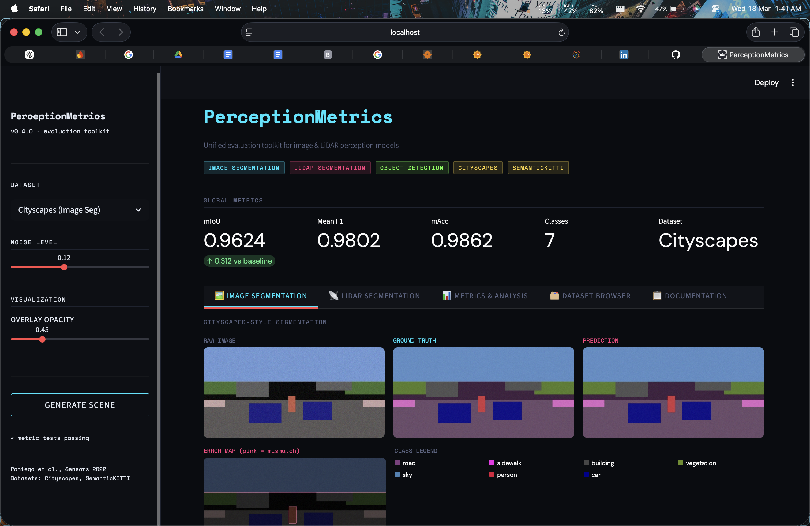
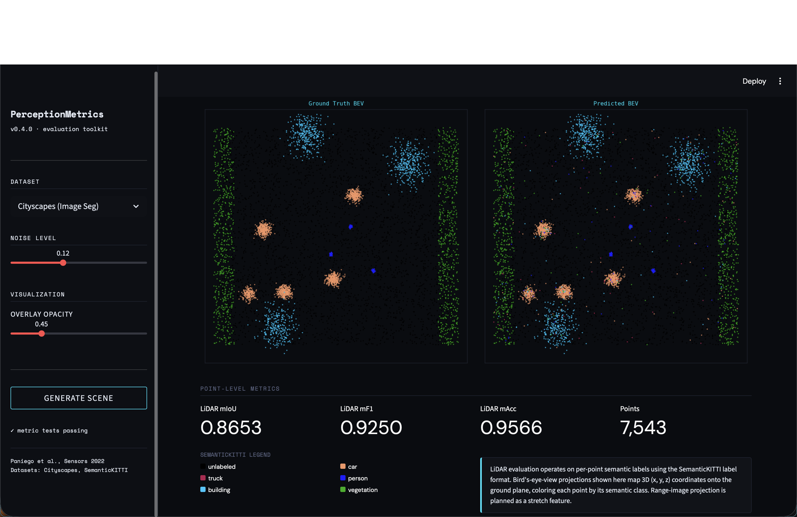
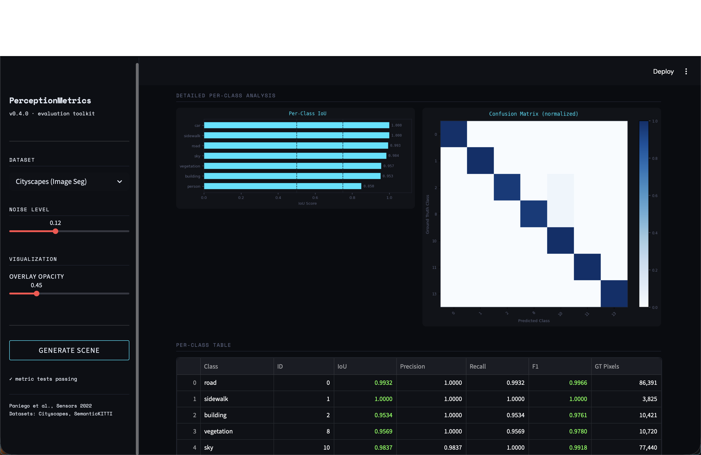
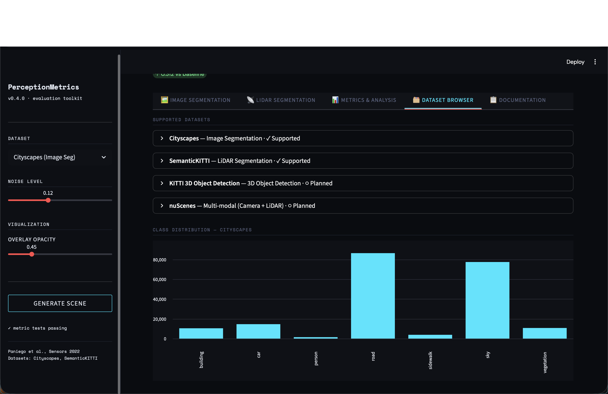

# PerceptionMetrics — Demo

> Extends [JdeRobot/PerceptionMetrics](https://github.com/JdeRobot/PerceptionMetrics) with
> Cityscapes image segmentation, SemanticKITTI LiDAR segmentation, and a full metrics GUI.  

[](https://perception-metrics.streamlit.app)

---

## Overview



The app opens on the **Image Segmentation** tab showing the global metric row (mIoU, Mean F1, mAcc, Classes, Dataset), a three-panel raw image / ground truth / prediction overlay, an error diff map highlighting misclassified pixels in pink, and a per-class legend — all driven by the noise level slider in the sidebar.

---

## Tabs

### 🖼 Image Segmentation — Cityscapes

19-class semantic segmentation with adjustable GT/prediction overlay opacity, a pixel-level error diff map (pink = mismatch), and a dynamic class legend showing only classes present in the current scene.

> *Global metrics — mIoU `0.9624` · Mean F1 `0.9802` · mAcc `0.9862` at noise=0.12*

---

### 📡 LiDAR Segmentation — SemanticKITTI



Bird's-eye-view point cloud projection with the full 20-class SemanticKITTI color palette. Ground truth and predicted labels shown side by side. Point-level metrics computed across all 7,543 points in the scene.

> *LiDAR mIoU `0.8653` · mF1 `0.9250` · mAcc `0.9566` · 7,543 points*

Labels are remapped via `uint32 & 0xFFFF` + `learning_map` lookup before metric computation — matching the exact remapping that `SemanticKITTIDataset` will perform before calling `SegmentationMetricsFactory.update()`.

---

### 📊 Metrics & Analysis



- **Per-class IoU bar chart** — color coded: red < 0.5, yellow 0.5–0.75, cyan ≥ 0.75
- **Normalized confusion matrix** — built from a global pixel-level accumulation, not per-image averaging
- **Per-class table** — IoU, Precision, Recall, F1, GT Pixels — color coded inline
- **Export** — CSV and JSON download buttons

The confusion matrix is computed identically to `SegmentationMetricsFactory.get_confusion_matrix()` in `perceptionmetrics/utils/segmentation_metrics.py` — global accumulation via `np.bincount` across all pixels before normalization.

---

### 🗂 Dataset Browser



Documents all four target datasets with format details, split structure, label remapping requirements, and implementation status. The class distribution bar chart shows pixel counts per Cityscapes class in the current scene.

| Dataset | Type | Status |
|---------|------|--------|
| Cityscapes | Image Segmentation | ✓ Supported |
| SemanticKITTI | LiDAR Segmentation | ✓ Supported |
| KITTI 3D Object Detection | 3D Detection | ○ Planned |
| nuScenes | Multi-modal Camera + LiDAR | ○ Planned |

---

### 📋 Documentation

Real `SegmentationMetricsFactory` API reference with proposed `CityscapesDataset` and `SemanticKITTIDataset` loader code — showing exactly how the new loaders feed into the existing interface without modifying `segmentation_metrics.py`.

---

## Key technical points

- Metrics computed from a **global confusion matrix accumulated across all pixels** — not averaged per image, which produces incorrect mIoU
- Mirrors `SegmentationMetricsFactory.update(pred, gt, valid_mask)` from `perceptionmetrics/utils/segmentation_metrics.py`
- Cityscapes void pixels (`label=255`) excluded automatically — `update()` masks out labels outside `[0, n_classes)` with no extra code
- SemanticKITTI `uint32` labels handled via bit-shift (`label & 0xFFFF`) + `learning_map` lookup to 19 evaluation classes
- GUI tab structure follows the `st.session_state` and `progress_callback` pattern from `tabs/evaluator.py`
- Metric self-test (`✓ metric tests passing`) runs on startup — validates perfect IoU=1.0, zero overlap IoU=0.0, and a known partial overlap case

---

## How this maps to the real codebase

The current PerceptionMetrics supports RUGD, RELLIS-3D, GOOSE, and WildScenes via
`SegmentationDataset` in `perceptionmetrics/datasets/segmentation.py`. Cityscapes and
SemanticKITTI are missing because they require dedicated label remapping that the existing
`GenericDataset` in `generic.py` does not handle.

This demo shows:
1. What `CityscapesDataset` and `SemanticKITTIDataset` produce after remapping
2. How the output feeds into the existing `SegmentationMetricsFactory.update()` interface
3. What the new `tabs/segmentation_evaluator.py` tab would look like

The metric engine (`segmentation_metrics.py`) is **not changed** — this builds entirely on top of it.

---

## Run locally

```bash
git clone https://github.com/YOUR_USERNAME/perception-metrics-gsoc-demo
cd perception-metrics-gsoc-demo
pip install -r requirements.txt
streamlit run demo.py
```

**requirements.txt**
```
streamlit==1.32.0
numpy==1.26.4
opencv-python-headless==4.9.0.80
Pillow==10.2.0
matplotlib==3.8.3
pandas==2.2.1
```

> Note: `opencv-python-headless` is required for cloud deployment. Replace with `opencv-python` for local use.

---
 
